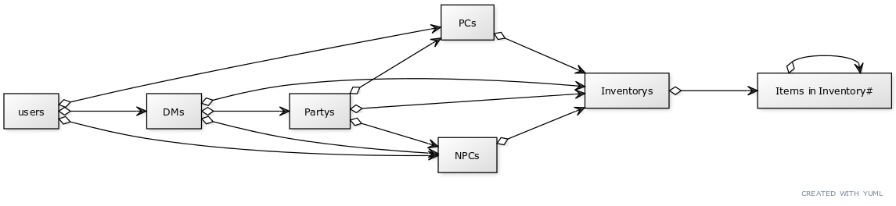
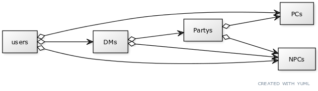
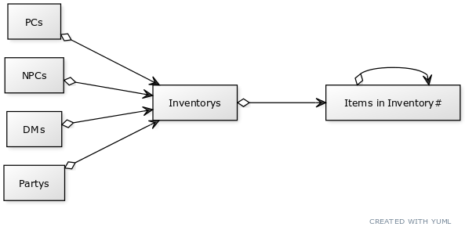

# Database

This directory is supposed to contain files for the database. The Diagrams should show which tables has relations to which other tables.

The diagrams are made using [this UML diagram generator](https://yuml.me/diagram/scruffy/class/draw).

The text can be found in [complete_table_relations.txt](complete_table_relations.txt).

## Relations
### Definitions
Word | Description
---|---
control | see and edit names, inventories and members and respective attributes of those in recursive fashion

### Complete

#### User
Top level is the user. A user can have PCs, DMs and NPCs which they control.

#### PCs
A PC is controlled by a user.
A PC can be a part of a party.
A PC has control over an inventory.

#### DMs
A DM is contolled by a user.
A DM controls Partys and/or NPCs.

#### NPCs
A NPC is "controlled" by a user or a DM.
It can be part of a party.
It controls an inventory.

#### Partys
Partys have PCs and NPCs as part of them, but cant control them.
Partys can have their own inventories, for example storage halls in a city, controlled by the DM.

#### Inventories
Inventories are controlled by PCs, NPCs, DMs, or Parties.
Inventories have Items in them.

#### Items in Inventory#
For each Inventory in Inventories, a table with the respective Items exist. An Item can have its own Inventory, for example a Bag of Holding.

### Characters

### Inventory

